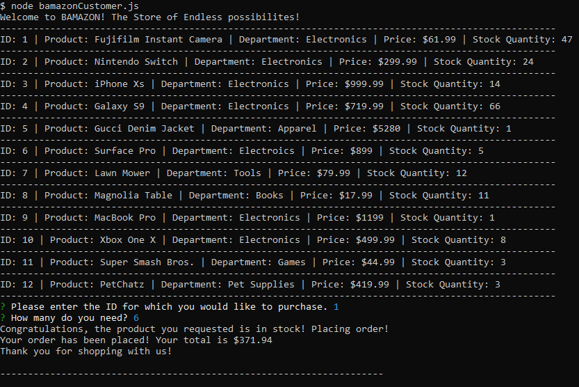
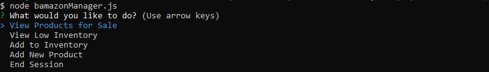
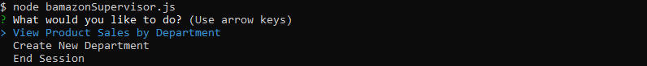

# Node-MySQL

I will be creating an Amazon-like storefront with the MySQL. The app will take in orders from customers and deplete stock from the store's inventory. As a bonus task, you can program your app to track product sales across your store's departments and then provide a summary of the highest-grossing departments in the store.

# MySQL Database Setup
In order to run this application, you should have the MySQL database already set up on your machine. If you don't, visit the MySQL installation page to install the version you need for your operating system. Once you have MySQL isntalled, you will be able to create the Bamazon database and the products table with the SQL code found in bamazonSchema.sql. Run this code inside your MySQL client like Sequel Pro to populate the database, then you will be ready to proceed with running the Bamazon customer and manager interfaces.

# Customer Interface
The customer interface allows the user to view the current inventory of store items: item IDs, descriptions, department in which the item is located and price. The user is then able to purchase one of the existing items by entering the item ID and the desired quantity. If the selected quantity is currently in stock, the user's order is fulfilled, displaying the total purchase price and updating the store database. If the desired quantity is not available, the user is prompted to modify their order.

The customer interface will display the image below:

To run the customer interface please follow the steps below:

<ol>
  <li>git clone git@github.com:valfragier16/Node-MySQL.git</li>
  <li>cd Node-MySQL</li>
  <li>npm install</li>
  <li>node bamazonCustomer.js</li>
</ol> 

<a href="https://drive.google.com/file/d/1hnqsvTF0Ev_eVkEEvhmEQUFKOAJT_Dzg/view" target="_blank">Bamazon Customer Demo </a>

# Manager Interace
The manager interface presents a list of five options, as below.

  
The View Products for Sale option allows the user to view the current inventory of store items: item IDs, descriptions, department in which the item is located, price, and the quantity available in stock.

The View Low Inventory option shows the user the items which currently have fewer than 100 units available.

The Add to Inventory option allows the user to select a given item ID and add additional inventory to the target item.

The Add New Product option allows the user to enter details about a new product which will be entered into the database upon completion of the form.

To run the manager interface please follow the steps below:

<ol>
  <li>git clone git@github.com:valfragier16/Node-MySQL.git</li>
  <li>cd Node-MySQL</li>
  <li>npm install</li>
  <li>node bamazonCustomer.js</li>
</ol> 

<a href="https://drive.google.com/file/d/1VSNJI3YePpS-CgxiN--Q5886hHDOdqXv/view" target="_blank">Bamazon Manager Demo </a>

# Supervisor Interace
The supervisor interface presents a list of three options, as below.

The Product Sales by department option will display the table with all of our products similar to the table displayed for the customer interface. However this table will include an "Over head costs", "Product Sales", and "Total profit" column, in which the formula of Product sales - Over head costs will calculate the Total profit. 

To run the supervisor interface please follow the steps below:

<ol>
  <li>git clone git@github.com:valfragier16/Node-MySQL.git</li>
  <li>cd Node-MySQL</li>
  <li>npm install</li>
  <li>node bamazonCustomer.js</li>
</ol> 

<a href="https://drive.google.com/file/d/1J-022D99quXj66T14yOOTrxP8p8FU80e/view" target="_blank">Bamazon Supervisor Demo </a>

